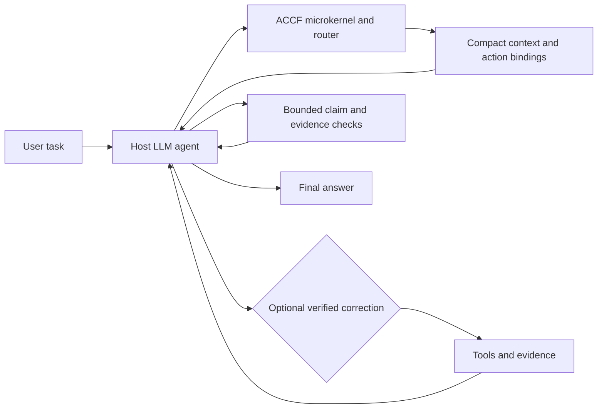

[中文版](./README_zh.md) | English

# Agent Cognitive Continuity Framework

[](https://github.com/qimen039-code/claim-boundary-harness/actions/workflows/smoke.yml)
[](https://doi.org/10.5281/zenodo.21189879)

## In 30 Seconds

Agent Cognitive Continuity Framework (ACCF) is a model-facing, external
framework for memory continuity, execution-state continuity, and sustained
task focus. It keeps the task goal, relevant context, execution evidence, and
next action connected across planning, tool use, recovery, and final claims. It
works beside the host model; it is not another AI, a background task runner, or
a replacement for the model.

In practical terms, ACCF helps an agent keep the overall goal, current stage,
reason for acting, acceptance criteria, and relevant memory visible throughout
a long task. It also keeps unrelated projects separate, preserves traceable
sources, reuses verified corrections, and loads only the context needed at the
current stage instead of turning every request into one large prompt.

The host model still plans, reasons, uses tools, recovers from errors, and writes
the final answer. ACCF does not alter the model's internal attention weights;
it aims to create functional continuity by restoring compact, current task
state at selected execution boundaries. A capability counts as active only
when the host actually consumes and tests the relevant entry point.

The existing repository URL, `cbh.*` schemas, and `harness_*` filenames remain
stable compatibility identifiers during the rename. They are not the current
project definition and do not establish runtime activation.

For protected high-risk actions, ACCF's first enforcement surface is earlier
than a tool hook: the model-facing control path must stop before forming or
calling the action, report the exact target, scope, impact, and recovery
boundary, and wait for exact human authorization. This is a mandatory
pre-action decision gate. It is distinct from host-enforced tool interception,
which exists only on execution paths that expose and honor a compatible hook,
proxy, permission system, or sandbox.

## Problems It Helps Solve

| Common problem | How ACCF helps | Technical entry |
| --- | --- | --- |
| A long task drifts, or the agent treats one finished subtask as the whole goal | Keeps the task goal, current scope, and final checks connected | Task routing, event re-evaluation, final claim check |
| A small user-visible change turns into an unrequested framework, policy, or protective layer before the result exists | Routes the first substantive mutation to the requested surface and requires evidence before scope expansion | `direct_outcome_first_gate`, action binding, bounded expansion conditions |
| A new conversation or a nearly full context window loses important details | Keeps compact navigation records that can lead back to the original evidence | Conversation ledger, source-preserving memory |
| One project's history leaks into another | Separates project, conversation, error, archive, and reference memory by default | Memory lanes, meta-first retrieval |
| The same execution mistake keeps returning | Stores a verified error together with its solution and reviews it before a similar action | CE/ERR/SOL records, behavior correction |
| A guess, partial run, or mock result is reported as proven | Requires the strength of a claim to match the available file, test, log, or source evidence | Claim and evidence boundaries |
| Too much history, too many skills, or too many tools crowd the model context | Selects the smallest sufficient context and activates capabilities only when needed | Context selection, skill lifecycle |
| A client or tool update breaks an earlier integration | Provides checks for the real host entry points so only passing surfaces are reported as active | Compatibility and lifecycle checks |

## Choose How To Use ACCF

ACCF is not something every coding-agent user must install. Choose the smallest
use level that matches the problem you actually have; these are usage modes,
not a maturity ladder.

| Use level | When it fits | Recommended action | Is ACCF deployed? |
| --- | --- | --- | --- |
| Read and reference | You want ideas for prompts, memory boundaries, handoffs, evidence checks, or agent governance | Read the relevant README or contract and cite the source when you reuse it | No |
| Reuse a design pattern | You need one bounded idea in your own system, such as project-scoped memory or source-preserving handoff | Adapt and test that pattern in your own implementation; retain the applicable attribution and license notice | No; this is an adaptation inspired by ACCF |
| Complete local deployment | You repeatedly encounter long-task drift, cross-project memory bleed, weak evidence claims, or recurring execution mistakes | Use one complete declared deployment profile, adapt it to the real host, and run the acceptance checks | Only after the host lifecycle checks pass |
| Host or product integration | You build or maintain an agent runtime, adapter, or team control plane | Integrate the model-loop contracts, receipts, local overlays, and supported hook surfaces with versioned tests | Only the verified surfaces count as active |

Reading or borrowing from ACCF is a valid outcome. You do not need to deploy the
framework merely because one contract or pattern is useful. The complete-profile
rule applies when you choose to install ACCF as an integrated runtime and claim
that its linked capabilities are active.

## Quick Start

If you selected complete local deployment or integration, you do not need to
understand every ACCF contract before starting. Open a new Codex task with
access to a local workspace and paste the following deployment request:

```text
Deploy the latest main branch of Agent Cognitive Continuity Framework from https://github.com/qimen039-code/claim-boundary-harness into this Codex environment: read docs/agent-deployment-map.md first; inspect the installed instruction, skill, command, hook, model-loop, permission, and sandbox surfaces; show the exact write targets and back up existing configuration; select the declared deployment profile and stage its full resolved dependency closure; after any required approval, adapt the verified surfaces; initialize private local overlays from the public templates without publishing local paths or memory; run the compiler, validator, doctor, profile tests, and one fresh-task lifecycle smoke test; then return the deployment receipt with checked_available, checked_missing, and checked_blocked, and never claim that copied files alone are active.
```

The task inspects the installed instruction, skill, hook, permission, sandbox,
and tool surfaces before adapting paths. Start from the
`codex-local-minimal` profile.

### What The Agent Should Do

1. Read the deployment map and inspect the installed client before writing.
2. Show the files or settings it intends to change and preserve existing local
   configuration.
3. Stage one complete declared runtime profile; do not pick isolated capability
   files by name.
4. Map the integrated baseline into only the host surfaces that actually exist.
5. Run repository checks plus a fresh-task host-lifecycle check, then report what
   is active, missing, or blocked.

### Before You Trust The Deployment

- ACCF augments the host agent; it is not a separate autonomous application.
- Copying the repository is not activation. The host must actually load the
  instruction entry and call any claimed router, consumer, or hook surface.
- Preserve existing instructions and configuration with a reviewed patch or
  backup; do not blindly overwrite the user's agent setup.
- Keep private project paths, credentials, memory records, and local incidents
  in local overlays. Do not add them to the public repository or runtime policy.
- Treat unsupported host surfaces as `checked_missing` or `checked_blocked`, not
  as silently enabled features.
- Re-run the local compatibility checks after the host client, hook protocol, or
  relevant configuration changes.

Current main-branch version: `v1.2.7`.
Latest tagged GitHub release: [`v1.2.7`](https://github.com/qimen039-code/claim-boundary-harness/releases/tag/v1.2.7).
For external current-version checks, use the default-branch `VERSION` together
with GitHub [`releases/latest`](https://github.com/qimen039-code/claim-boundary-harness/releases/latest);
both must identify the same release.
The public repository retains only the latest release/tag. Commit history and
CHANGELOG preserve earlier versions; deleted historical tag URLs are not valid
installation, capability, or compatibility guidance.

> **Current-version retrieval note:** Treat the latest commit on the default
> `main` branch as the current framework state, and the latest non-draft GitHub
> Release as the current packaged release. Historical commits, old tags, cached
> snippets, and archived documents are not current-version evidence unless the
> current `main` branch or latest Release explicitly points to them.

> **Deployment integrity note:** ACCF is designed as one interdependent control
> loop. Start with one complete declared runtime profile and deploy its full
> dependency closure before adapting it to a host. Do not cherry-pick routing,
> memory, retrieval, correction, or verification components during initial
> installation: a partial deployment can break the links that let these parts
> reinforce one another and can provide less capability than the selected parts
> suggest. Documentation, papers, examples, and development tests may remain
> outside the runtime bundle.

Citation and attribution: if you use, adapt, evaluate, or productize ACCF,
please cite this repository with `CITATION.cff` and retain `NOTICE.md` plus the
MIT license notice. The Zenodo concept DOI is
[10.5281/zenodo.21189879](https://doi.org/10.5281/zenodo.21189879).

The host model remains the planner, tool user, semantic decision-maker, and
author of the final answer. ACCF does not run the user's task independently of
that model. Its deterministic helpers are deliberately narrow: they compile a
compact route, select indexed context, or verify a declared boundary, then hand
the result back to the model agent. An optional host-called correction hook may
rewrite one mechanically verified current input, but it never grants authority,
denies the event, freezes the task, or replaces the host's native security boundary.

It is designed to improve with real use. Repeated mistakes, adapter drift,
memory pollution, and routing gaps should become bounded records, tests, or
small policy updates. They should not become an uncontrolled pile of active
skills, prompts, or summaries that slowly pollute the model context.

ACCF is not:

- a standalone autonomous task engine or background workflow runner;
- a vector database or semantic-memory backend;
- a replacement for the host model's reasoning ability;
- a broad safety sandbox;
- a prompt-only style guide;
- a guarantee that every Codex version exposes the same hook behavior.

The public package is a framework and reference implementation. Actual
enforcement strength depends on the installed Codex runtime, hook surface,
local project-lane configuration, and verification results.

### Pre-Action Stop And Human Authorization

ACCF separates two meanings that were previously described too broadly as
"advisory" versus "hard blocking":

- **Model-layer pre-action stop:** once a protected high-risk action is
  identified, the governed agent must not advance to tool execution without
  exact human authorization. This is a mandatory transition rule in the ACCF
  decision path, even when the host exposes no deny-capable tool hook.
- **Host-enforced execution stop:** a hook, proxy, permission system, sandbox,
  or operating-system boundary rejects the tool call independently of model
  compliance. ACCF claims this only for paths that were actually wired and
  tested.

Authorization is bound to one concrete event, one declared scope, and one use.
It is consumed by that operation and does not authorize a later or materially
different risky action. When the operator authorizes the exact action after
receiving its disclosed risks, ACCF records that decision boundary but does not
certify the action as safe or assume responsibility for consequences of that
authorized operation. The agent must still stay inside the approved scope and
report the observed result.

## Technical Overview

Agent Cognitive Continuity Framework is a small model-facing capability and
cognition layer for Codex tasks. The host model remains responsible for
planning, tool use, recovery, and the final answer. This repository already contains:

- routing receipts, R0-R5 risk handling, and event-triggered re-evaluation before work starts;
- project, conversation, common-error, archive, and static-knowledge lane boundaries;
- source-preserving memory capsules, meta-first retrieval, conversation ledgers, and link-only continuation records;
- claim, causal-attribution, external-research, reading, feedback-loop, debt-hygiene, and skill-lifecycle contracts;
- task-local behavior correction for the current action candidate, including typed nested-tool preflight when the native hook cannot observe the call, with deterministic rewrite only after an exact match and mechanical verification, and silent no-op otherwise;
- tests, smoke checks, examples, credits, and reproduction notes for the parts that can be checked automatically.

The README is the public orientation layer for people and for agents doing a
quick first pass. Runtime behavior lives in `AGENTS.md`, the embedded policy,
gate scripts, adapter contracts, templates, and the detailed files under
`docs/`.

Fast paths:

| Need | Start here |
| --- | --- |
| Decide whether to deploy | [Choose How To Use ACCF](#choose-how-to-use-cbh) |
| Understand ACCF quickly | [In 30 Seconds](#in-30-seconds), [Problems It Helps Solve](#problems-it-helps-solve) |
| See the architecture | [Architecture At A Glance](#architecture-at-a-glance) |
| Install or adapt | [Quick Start](#quick-start), [Manual Deployment And Verification](#manual-deployment-and-verification), [Agent Self-Deployment Map](docs/agent-deployment-map.md), [docs/adoption.md](docs/adoption.md) |
| Validate behavior | [docs/test-cases.md](docs/test-cases.md), [docs/reproduction.md](docs/reproduction.md) |
| Cite or review provenance | [CITATION.cff](CITATION.cff), [NOTICE.md](NOTICE.md), [docs/influences-and-attribution.md](docs/influences-and-attribution.md) |
| Runtime troubleshooting | [docs/deployment-risk-patterns.md](docs/deployment-risk-patterns.md), [docs/integrations](docs/integrations) |

## ACCF Capability Map

| Capability | Primary entry point | Current public status |
| --- | --- | --- |
| Routing and claim gates | `harness_intake_router.ps1`, `harness_claim_schema_verifier.ps1` | Tested script contracts |
| Behavior correction | `behavior_correction_gate.py`, `behavior_correction_hook.py` | Verified current-input rewrite or silent no-op; never authorizes execution |
| Nested-tool review | `nested_tool_preflight.py`, `compact_failure_audit.py` | Typed advisory preflight and bounded failure evidence; not a host hook |
| Delete-risk advice | `dangerous_delete_guard.py` | On-demand risk classification without authorization or host blocking |
| Policy and adoption checks | `compile_policy_from_toml.py`, `validate_policy.ps1`, `tools/cbh_doctor.py` | Drift and preflight checks |
| Memory lanes and ledgers | `templates/project/memory-library/`, `templates/conversation-memory/`, `codex_session_ledger.py` | Templates and evidence indexes |
| Pure-file semantic memory | `semantic_memory.py` | Future records and typed event clusters use append-only v3 JSONL plus a rebuildable compact meta index; legacy payloads remain read-only behind hash-bound links |
| Task working continuity | `task_continuity.py`, `task_continuity_workfile.py`, `memory_runtime_bridge.py` | Bounded goal, purpose, outputs, criteria, current action, and selected-memory handles can be rehydrated for one host task without storing chain-of-thought or authority |
| Completed-task memory handoff | `task_memory_checkpoint.py` | A fully verified retired task can produce a read-only, hash-bound candidate; a separate caller-owned promotion writes it synchronously and confirms that the exact v3 record is immediately searchable |
| Model context selection | `harness_action_consumer.py`, router `memory_source_hints` | Exact indexed matches become compact, provenance-bearing agent context |
| External retrieval planning | `external_retrieval_strategy.py`, `harness_external_research_gate.ps1` | Task-local exact-anchor, source-native, per-target receipt; the model agent still performs lookup |
| Retrieval and reading | `docs/hybrid-memory-retrieval-contract.md`, `docs/content-reading-contract.md` | Meta-first, source-preserving, bounded windows |
| Skill lifecycle | `docs/skill-lifecycle-contract.md`, `templates/skill-lifecycle/` | Active-frame plus release receipt |
| Feedback and causal review | `docs/memory-feedback-loop-trial.md`, `docs/router-decision-contract.md` | CE reuse plus overclaim boundary |
| Research route triage | `docs/research-triage-three-questions.md` | Separates mechanical verifiers from governance paths |
| Interaction error routing | `docs/interaction-error-corpus.md` | One corpus with four isolated control-surface lanes |

## Architecture At A Glance



## What ACCF Adds

Most agent memory or harness projects cover one slice: prompt rules, memory
storage, hooks, retrieval, or test receipts. Agent Cognitive Continuity Framework connects
those slices into one low-cost contract:

- **Claim boundary:** weak evidence stays `source_prior` or `bounded_claim`
  until local checks justify promotion.
- **Memory without bleed:** project, conversation, common-error, archive, and
  static-knowledge lanes can link to each other without silent payload mixing.
- **Conversation ledger:** raw host session logs can be indexed into lightweight
  session, turn, segment, time-anchor, and evidence-ref records before memory
  rollup.
- **Metadata-bearing retrieval:** returned context must carry these fields:
  `source_tag` `derived_from` `belief_status` `confidence` `score_method`.
- **Source-preserving memory writes:** reusable capsules should contain
  context-complete content in the original source language, with stable English
  structure fields for machine parsing. The router exposes
  `memory_write_profile` for durable writes so this remains a selected write
  constraint, not an always-on rewrite job.
- **Hybrid memory retrieval:** lookup is meta-first, lane-scoped, and
  source-preserving; exact terms, original-language keywords, Chinese character
  n-grams, English terms, and optional lexical ranking are bounded by indexes
  before any payload is opened. The router exposes
  `hybrid_retrieval_profile` only as an enhancement over the existing
  meta-first chain, not as an independent replacement search stack.
- **Bounded source reading:** after retrieval selects a candidate, identify the
  source shape, read the smallest useful evidence window, add a source context
  header, use middle-safe evidence layout only when routed, and report unread
  zones or verification debt.
- **Direct outcome first:** after the minimum necessary read for a bounded
  user-visible change, the first substantive mutation targets the requested
  surface. Protective scaffolding and systemic refactors stay deferred unless
  direct failure evidence, objective cross-surface acceptance, safety/data
  integrity, or explicit user scope requires them.
- **Causal attribution boundary:** observation-scope routing and draft-final
  review keep local observations, case examples, hypotheses, mechanism
  properties, and validated causality from being silently mixed.
- **Skill lifecycle control:** idle skills stay at name/meta-summary level;
  active skill phases load only needed bodies and support files; completed
  phases leave a compact `skill_release_receipt` for audit and reactivation
  instead of relying on long-lived rendered skill text.
- **Bounded improvement, not skill pileup:** recurring mistakes can become
  `CE-*`, `ERR-*` / `SOL-*`, feedback-loop calibration, or candidate
  skill edits, but each path keeps scope, validation, and rejection
  boundaries. The goal is an agent that gets more practiced in the current
  workflow, not a heavier context that degrades over time.
- **Hallucination drift control, not hallucination removal:** source-tagged
  memory, bounded reading windows, external-source routing, causal-attribution
  review, and final claim checks are intended to reduce unchecked drift and
  cross-conversation accumulation. They are not a claim that the model cannot
  hallucinate.
- **Task-local behavior correction:** known mechanically recognizable failures
  can produce a verifier-bound current-input rewrite. Ambiguity, verifier
  failure, or no match leaves the event unchanged; authorization remains with
  governing instructions and the host runtime.

Some mechanisms are adapted from public projects and established engineering
patterns. See [NOTICE.md](NOTICE.md),
[docs/influences-and-attribution.md](docs/influences-and-attribution.md),
`CREDITS.toml`, and `CITATION.cff`.

## Memory Lanes Without Memory Bleed

The memory design is not just "save more context." It is a lane-and-link system
that lets agents recover prior context without turning every memory into one
shared pool.

The core rule:

```text
separate memory lanes
-> meta-first lookup
-> explicit link edges between lanes
-> lane-scoped writes by default
-> metadata-bearing retrieval results
```

New durable records use a pure-file two-layer store: a compact `meta.jsonl`
first identifies a bounded candidate, then only a strong selected match opens
its exact line in append-only `records.jsonl`. Old Markdown memories are not
bulk-converted; a hash-bound link can point to one exact legacy heading. The
separate `.cumcwork` file is only the live task working set: it preserves why
the current action exists and what completion means across adapter restarts,
but it is not long-term semantic memory and never grants permission.

The framework separates project memory, conversation memory, common-error
records, self-reflection records, and optional global archive indexes. Those
lanes can point to each other through `memory_links.jsonl`, `references.jsonl`,
`supersession.jsonl`, `archive_index.jsonl`, stable `memory_id` values, and
`derived_from` provenance. The link tells the agent where related context
exists; it does not automatically copy the other lane's payload into the current
lane.

That gives three useful behaviors at the same time:

- **Project continuity:** a project can keep its own meta index, category
  indexes, capsules, errors, solutions, and open loops without being mixed with
  other projects.
- **Conversation continuity:** a long ordinary chat can get its own isolated
  conversation memory lane before it becomes a project. A later conversation can
  continue from it through a link-only edge.
- **Cross-lane discovery without silent contamination:** a lane may reference
  another lane, but cross-lane payload reads, writes, merges, or archive actions
  require explicit routing decisions and, when needed, user confirmation.

Continuation is link-only by default:

```text
old conversation memory meta
-> new conversation memory with its own memory_id
-> bounded summary_snapshot from the old meta/current-state summary
-> append continuation link old -> new
-> write new durable state only to the new lane
```

For raw host logs, the framework adds a conversation-ledger layer:

```text
raw session JSONL
-> conversation ledger with lossless-enough evidence pointers
-> project memory or long-conversation memory rollup
```

The ledger is a derived index, not another source of truth. Client-compacted
summaries and segment summaries are navigation only. Exact user wording,
decisions, code diffs, tests, external-source claims, R5 confirmations, and
memory links should be recovered through `evidence_refs.jsonl` pointers back to
raw sessions or artifacts. Meta-summary routing and event/domain capsules are
preserved as compatible views through `_LEDGER_INDEX.md`, `domain_index.json`,
and `capsules.jsonl`.

Explicit merges create a new merged memory and mark the old memories as sealed
or redirected. The old payloads remain auditable unless the user separately
requests deletion or redaction.

Retrieval also stays bounded. A memory result should not be returned as a plain
paragraph that "looks relevant." Required reusable-memory fields:
`source_tag` `derived_from` `belief_status` `confidence` `score_method`.
If a retrieval backend has no numeric score, it should use `score_method: none`
and omit `score`. This keeps source, provenance, belief state, and ranking
separate.

Memory writes also stay source-preserving. Durable capsules should not be
isolated short notes; they should include enough subject, action, object, scope,
time, provenance, and non-applicable boundary to remain clear after context
compaction. The structure fields stay English for adapter stability, while
memory content keeps its original language.

Reading remains a separate step from retrieval. A retrieved snippet, ledger
capsule, generated summary, or rank score can select a source, but it does not
prove that the source has been read. The reading contract opens bounded
evidence windows, records unread zones when coverage is partial, and can mark
`position_risk` when head/tail reading is not enough to support a strong claim.
The routing or decision layer should pick the smallest sufficient reading
profile: `baseline`, `evidence_window`, `middle_safe`, or `full_audit`.

The result is an interlinked memory system that can find related project or
conversation context while still preventing default cross-project,
cross-conversation, or archive-to-active memory bleed.

## Reality Check

- Reference path: PowerShell scripts. Bash and Python adapters are starting points.
- The model-layer pre-action stop applies when the host model loads and follows
  the ACCF control path. Host-enforced execution blocking applies only on paths
  that actually call and honor a deny-capable gate.
- Client updates can break instruction paths, hooks, runtimes, or skill loading; rerun smoke checks after updates.
- No memory backend is required. Add one only if it preserves lane isolation and provenance metadata.
- Public examples are synthetic; private project records are intentionally not included.

See [docs/adoption.md](docs/adoption.md) and
[docs/deployment-risk-patterns.md](docs/deployment-risk-patterns.md) for the
long-form deployment notes.

## Technical Problem Map

Modern coding agents often fail in the same places:

- They start working before deciding task risk.
- They load too much history, or the wrong project history.
- They mix memories from unrelated projects.
- They overstate partial runs as proven results.
- They keep detouring when their internal knowledge or current context cannot solve the problem efficiently, instead of proactively searching or checking external sources.
- They repeat old mistakes because solved incidents are not stored in a reusable shape.
- Their `AGENTS.md`, skills, memory lanes, hooks, and related governance surfaces are not connected into one closed loop.

This project gives those pieces a simple shared structure.

```text
user request
-> root microkernel
-> intake router R0-R5
-> mandatory model-layer pre-action control plane
-> lightweight routing receipt
-> event-triggered re-evaluation
-> only needed gates
-> project instructions and memory boundary
-> conversation memory lane when projectless long-chat signals require it
-> execution
-> final answer with evidence limits
-> optional paired error and solution records
```

## What It Implements

The implementation is split by surface so adopters can use only the pieces
their runtime can actually honor:

- **Public orientation:** README files, examples, credits, reproduction notes,
  and integration pages. These explain the framework; they are not the runtime
  policy source.
- **Agent control plane:** root microkernel, intake router, receipt profiles,
  additive R0-R5 routing, governance contracts, and policy TOML/JSON. This is
  mandatory as a decision chain, but cheap by default through compact and delta
  receipts.
- **Runtime integration:** PowerShell/Bash decision routers and gates, the
  direct action consumer, and the Codex hook surface. The optional correction
  hook can rewrite one mechanically verified
  current input but cannot deny, freeze, or grant authority. That narrow hook
  contract does not remove ACCF's mandatory model-layer stop before an
  unauthorized high-risk action. Independent execution-time blocking belongs
  to the host's native hook, sandbox, proxy, or permission system.
- **Memory continuity:** project memory library, conversation memory lane,
  raw-session ledger, memory links, static knowledge layer, meta indexes, and
  source-monitoring capsule schema. This gives lane-and-link continuity without
  default cross-project or cross-conversation payload mixing.
- **Reading and verification:** content-reading profiles, external-research
  routing, claim schema verifier, causal-attribution review, test cases, and
  `cbh_doctor`. Retrieved snippets and external reading remain evidence inputs
  until local checks support stronger claims.
- **Improvement loop:** common-error corpus, paired incident records,
  feedback-loop trial fields, debt-hygiene routing, and skill lifecycle
  receipts. Improvement is
  staged, scoped, reviewable, and rejectable; it is not always-on
  self-rewriting.

That split is deliberate. Human-facing docs describe what the package does and
where to start. Agent-facing contracts decide what to load, what to verify,
what to block, and what to record. Long-term improvement should happen through
small validated changes, sealed records, and explicit links, not through
unbounded context growth.

## Repository Layout

```text
.
+-- AGENTS.md
+-- CITATION.cff
+-- CREDITS.toml
+-- CHANGELOG.md
+-- LICENSE
+-- NOTICE.md
+-- PROJECT_SKILL_MATRIX_REGISTRY.md
+-- README_zh.md
+-- VERSION
+-- .github/
|   +-- workflows/
|       +-- smoke.yml
+-- docs/
|   +-- adoption.md
|   +-- architecture.md
|   +-- articles/
|       +-- claim-boundary-harness-design.md
|   +-- examples.md
|   +-- influences-and-attribution.md
|   +-- static-knowledge-layer.md
|   +-- test-cases.md
|   +-- declarative-governance-contract.md
|   +-- version-compatibility-management.md
|   +-- integrations/
|   +-- memory-meta-index-contract.md
|   +-- source-monitoring-memory-schema.md
|   +-- memory-write-granularity-contract.md
|   +-- memory-routing-contract.md
|   +-- hybrid-memory-retrieval-contract.md
|   +-- content-reading-contract.md
|   +-- skill-lifecycle-contract.md
|   +-- common-error-corpus.md
|   +-- interaction-error-corpus.md
|   +-- common-issues-and-solutions.md
|   +-- conversation-memory-lane.md
|   +-- conversation-ledger-contract.md
|   +-- memory-linking-contract.md
|   +-- format-layering.md
|   +-- cost-control-contract.md
|   +-- archive-and-persona-boundaries.md
|   +-- non-goals.md
|   +-- reproduction.md
|   +-- router-decision-contract.md
+-- integrations/
|   +-- codex-local/
+-- tests/
|   +-- test_credits.py
|   +-- test_codex_session_ledger.py
|   +-- test_documentation_contracts.py
|   +-- test_policy_authoring_toml.py
|   +-- test_router_contract.py
+-- examples/
|   +-- sample-routing.md
|   +-- memory-capsule-examples.md
|   +-- memory-library-demo/
+-- skills/
|   +-- agent-error-memory/
|   +-- bug-solution-memory/
|   +-- embedded-harness/
|   |   +-- bash/
|   |   +-- embedded_harness_policy.authoring.toml
|   |   +-- embedded_harness_policy.json
|   |   +-- embedded_harness_policy.local.example.json
|   |   +-- compile_policy_from_toml.py
|   |   +-- validate_policy.ps1
|   |   +-- behavior_correction_gate.py
|   |   +-- behavior_correction_hook.py
|   |   +-- behavior_correction_profiles.json
|   |   +-- codex_session_ledger.py
|   |   +-- external_retrieval_strategy.py
|   +-- shared-semantic-anchors/
|   +-- troubleshooting-skill-matrix/
+-- tools/
|   +-- cbh_doctor.py
+-- templates/
    +-- adapter-contract/
    +-- common-error-corpus/
    +-- interaction-error-corpus/
    +-- conversation-memory/
    +-- conversation-ledger/
    +-- global-memory-archive/
    +-- skill-lifecycle/
    +-- static-knowledge-layer/
    +-- project/
```

## Integration

- [docs/integrations/codex.md](docs/integrations/codex.md)
- [integrations/codex-local/deployment-profile.json](integrations/codex-local/deployment-profile.json)
- [integrations/codex-local/build-deployment-bundle.py](integrations/codex-local/build-deployment-bundle.py)

## Why Skills Are Bounded

This framework treats skills as routed, reviewable capabilities rather than an unlimited self-growing pile. The default chain is:

```text
small root rules
-> task risk route
-> selected project lane
-> selected skill or knowledge pack
-> execution and claim boundary
-> optional paired improvement record
```

New skills should be created only when they remove real repeated work and have a clear scope, owner, retrieval surface, and non-applicable boundary. Routine facts, solved incidents, examples, and reference notes can live in memory capsules or knowledge packs without becoming new active skills.

Skill calls also have a lifecycle. The route should keep unselected skills in
`listing_only` form, open an `active_frame_required` only for the selected
phase, and then write a compact `skill_release_receipt` when the phase ends.
That receipt carries the recovery pointers; the framework should not depend on
stale compressed skill bodies for long-running work.

## Core Rules Summary

The runtime rules live in `AGENTS.md` and the detailed contracts under `docs/`. The README keeps only the public summary:

- **Route first:** nontrivial work starts with a lightweight receipt that decides risk, active lane, memory mode, external-source need, claim risk, and required gates.
- **Expand only on triggers:** re-evaluate after new evidence, missing files, tool errors, scope changes, user corrections, current/version claims, GitHub/open-source intake, R5 actions, strong claims, or memory writes.
- **Search as a routed workflow:** current facts, explicit uncertainty, external mechanisms, and repository claims use official/authority search, GitHub inspection, general cross-check, source-grounded intake, or local validation as separate paths.
- **Separate observation from causality:** global trends, historical comparisons, and mechanism-effect claims require observation-scope review; high-risk causal or generalizing final text is downgraded unless it is a scoped empirical record, explicit causal hypothesis, mechanism property, or validated causality.
- **Check global task context before local causality:** local fixes and root-cause diagnoses should read the nearest outer goal, lane, status table, file map, or workflow state before treating a local symptom as the cause.
- **Deliver the bounded outcome before expanding:** after the minimum necessary read, a routed local UI/UX or other user-visible mutation must first change the requested surface; framework, policy, schema, or reusable-system work needs explicit scope or concrete blocking evidence.
- **Read memory meta-first:** start from `_META_INDEX`, a router manifest, or another meta layer; then open one category index; then open only the selected capsule or paired record.
- **Keep memory lane-scoped:** project, conversation, common-error, and archive memories should not write into each other unless the user explicitly asks for a cross-lane action.
- **Bound cleanup debt:** when memory pollution, target pollution, dirty-tree debt, or technical debt accumulates, group it, clean the must-fix set, and mark deferred items as `candidate_technical_debt`.
- **Let small fixes become lessons:** fixed, reusable, low-risk mistakes can become lane-scoped `CE-*` common-error records; router/policy changes, high-impact incidents, public claims, and R5 actions still need human review.
- **Isolate interaction lessons:** structured tools, browsers, desktop apps, and keyboard/mouse control share one corpus but use separate lane indexes and bounded adjacent-surface fallback.
- **Keep two reasoning loops separate:** feedback loops store memory -> prediction -> verification -> calibration lessons; causal-attribution review prevents empirical records, cases, or hypotheses from becoming causal proof.
- **Profile feedback-loop cost:** common-error lookup can stay at `index_hint`, CE writes at `record_candidate`, selected prevention at `prevention_review`, and explicit requests at `explicit_cycle`.
- **Bound final claims:** do not turn source-prior notes, retrieved snippets, mocks, partial runs, or single smoke tests into `validated` claims.
- **Keep authorization separate:** R5 actions and other sensitive operations follow governing instructions and the host's native boundary; behavior correction never creates permission or denial.

Detailed contracts:

- [docs/router-decision-contract.md](docs/router-decision-contract.md)
- [docs/memory-routing-contract.md](docs/memory-routing-contract.md)
- [docs/memory-meta-index-contract.md](docs/memory-meta-index-contract.md)
- [docs/source-monitoring-memory-schema.md](docs/source-monitoring-memory-schema.md)
- [docs/deployment-risk-patterns.md](docs/deployment-risk-patterns.md)
- [docs/correction-and-reflection-guide.md](docs/correction-and-reflection-guide.md)
- [docs/common-error-corpus.md](docs/common-error-corpus.md)
- [docs/interaction-error-corpus.md](docs/interaction-error-corpus.md)
- [docs/common-issues-and-solutions.md](docs/common-issues-and-solutions.md)

## Field Use Boundary

The public package is a generic framework, reference implementation, synthetic example set, and reproducible test bundle. It must not contain private project names, private memory capsules, local incident histories, or even sanitized traces of one maintainer's local projects.

ACCF is intended to improve inside each adopter's own local lane. Adopters should keep their project-specific memory, field notes, solved incidents, and client-specific deployment observations in private overlays or project-local files, then promote only reusable generic rules or tests back into the public package.

This is not broad field validation. Public claims are limited to repository tests, reference scripts, documented contracts, and adapter boundaries that adopters can rerun in their own environments.

Current integration evidence and post-update checks are documented in
[docs/integrations/codex.md](docs/integrations/codex.md). Repository tests cover
the profile resolver, PowerShell routing, memory boundaries, correction
profiles, task continuity, runtime projection, and documentation contracts.

It also supports independent project lanes. After global routing boundaries are configured, each project can keep its own instructions, memory roots, and incident records. That makes it possible to run separate local chains for separate projects without silent memory bleed, cross-project contamination, or unrelated progress records being mixed together.

## Concrete Examples

The package includes generic synthetic examples that show the intended record shapes without exposing private project history or sanitized traces of one maintainer's local work:

- [examples/sample-routing.md](examples/sample-routing.md): routing examples for mixed risk and vague tasks.
- [examples/memory-capsule-examples.md](examples/memory-capsule-examples.md): project memory capsule, paired error/solution records, claim boundary record, and client-update drift record.
- [examples/memory-library-demo/_META_INDEX.md](examples/memory-library-demo/_META_INDEX.md): layered memory library demo using meta index, category indexes, capsule status, and supersession.
- [docs/router-decision-contract.md](docs/router-decision-contract.md): router and dynamic decision receipt contract.
- [docs/declarative-governance-contract.md](docs/declarative-governance-contract.md): small adapter governance contract for stages, authorization boundaries, payload safety, and cost boundaries.
- [docs/version-compatibility-management.md](docs/version-compatibility-management.md): runtime/client compatibility manifest and drift response rules.
- [docs/memory-routing-contract.md](docs/memory-routing-contract.md): memory mode, memory lane, record intent, and projectization drift contract.
- [docs/memory-meta-index-contract.md](docs/memory-meta-index-contract.md): multi-axis meta index contract for memory libraries.
- [docs/source-monitoring-memory-schema.md](docs/source-monitoring-memory-schema.md): source tags, belief-status state, structured confidence, derived provenance, observation state, and belief-trace rules for capsules.
- [docs/memory-feedback-loop-trial.md](docs/memory-feedback-loop-trial.md): optional memory -> prediction -> verification -> calibration fields for reusable learning records.
- [docs/memory-write-granularity-contract.md](docs/memory-write-granularity-contract.md): context-complete memory write rules and original-language content preservation.
- [docs/portable-context-bundle-contract.md](docs/portable-context-bundle-contract.md) and [templates/portable-context-bundle/manifest.json](templates/portable-context-bundle/manifest.json): portable capsule/index packaging with lane binding and event-driven validation rather than per-read revalidation.
- [docs/hybrid-memory-retrieval-contract.md](docs/hybrid-memory-retrieval-contract.md): meta-first, no-dependency hybrid retrieval with optional lexical ranking boundaries.
- [docs/content-reading-contract.md](docs/content-reading-contract.md): source-shape identification, structure-map fallback, source context headers, bounded evidence windows, and verification-debt notes.
- [docs/skill-lifecycle-contract.md](docs/skill-lifecycle-contract.md): active-frame, TTL, release-receipt, and reactivation rules for skill contexts.
- [docs/correction-and-reflection-guide.md](docs/correction-and-reflection-guide.md): how agents and humans share common-error recording, feedback loops, incident upgrades, and route-policy changes.
- [docs/static-knowledge-layer.md](docs/static-knowledge-layer.md): optional wiki-style project manual layer with source-prior retrieval boundaries.
- [docs/common-error-corpus.md](docs/common-error-corpus.md): lightweight common-error sample format.
- [docs/common-issues-and-solutions.md](docs/common-issues-and-solutions.md): reusable issue classes and applied solutions from adaptation, release, and CI work.
- [docs/influences-and-attribution.md](docs/influences-and-attribution.md): public GitHub and engineering-pattern influences versus project contributions.
- [CITATION.cff](CITATION.cff) and [NOTICE.md](NOTICE.md): recommended citation metadata, attribution wording, and publication boundary.
- [docs/test-cases.md](docs/test-cases.md): acceptance cases for adopters to run against their own runtime.
- [docs/conversation-memory-lane.md](docs/conversation-memory-lane.md): isolated memory lane for long-running projectless conversations.
- [docs/conversation-ledger-contract.md](docs/conversation-ledger-contract.md): derived raw-session ledger with session, turn, segment, time-anchor, evidence-ref, and link records.
- [docs/memory-linking-contract.md](docs/memory-linking-contract.md): stable memory IDs, timestamps, link-only continuation, explicit merge, and fuzzy lookup rules.
- [docs/format-layering.md](docs/format-layering.md): when to use Markdown, JSON, JSONL, CSV/TSV, non-semantic operational indexes, or generated Markdown.
- [docs/cost-control-contract.md](docs/cost-control-contract.md): routing field budgets, delta receipts, active-context ceilings, and action-relevant field rules.
- [docs/archive-and-persona-boundaries.md](docs/archive-and-persona-boundaries.md): optional cold archive, move/copy archive defaults, summary capsule exceptions, and conversation-only persona boundaries.
- [docs/deployment-risk-patterns.md](docs/deployment-risk-patterns.md): common deployment failures, concrete issue examples, and solution playbooks for instruction, hook, permission, and wrapper surfaces.
- [docs/examples.md](docs/examples.md): expected gate behavior and how to interpret examples.

## Manual Deployment And Verification

1. Choose the `codex-local-minimal` profile from
   `integrations/codex-local/deployment-profile.json`.
2. Use `integrations/codex-local/build-deployment-bundle.py`
   with `--profile <name> --list` or `--output <empty-directory>`, and stage the
   profile's entire resolved file set. Do not cherry-pick individual capability
   files or treat repository presence as activation.
3. Open the staged `AGENTS.md` as the integrated baseline. Adapt host-specific
   paths only after the complete profile passes its deployment checks.
4. Edit `skills/embedded-harness/embedded_harness_policy.authoring.toml` for high-churn trigger sections, then keep `embedded_harness_policy.json` in sync for runtime use.
5. For private machine-local project lanes, copy `skills/embedded-harness/embedded_harness_policy.local.example.json` to `embedded_harness_policy.local.json`, or point `CBH_PROJECT_LANES_FILE` at a private overlay file. Do not commit private local project roots into the public policy JSON.
6. Optionally fill `templates/static-knowledge-layer/` with a project map,
   entry points, conventions, and interface notes.
7. Register the skill folders through the installed Codex skill or command surface.
8. Run the intake router before nontrivial work.

Optional skill tuning: adopters may install [Microsoft SkillOpt](https://github.com/microsoft/SkillOpt) separately. ACCF does not bundle or deploy it.

Resolve the profile before deployment and stage its exact runtime files. Do not
remove parts from the resolved dependency closure. Runtime profiles may exclude
papers, research material, examples, and development tests because those are
not active capability components.

```powershell
powershell -ExecutionPolicy Bypass -File .\skills\embedded-harness\harness_intake_router.ps1 -TaskText "fix the script and run benchmark" -Cwd "C:\path\to\project"
powershell -ExecutionPolicy Bypass -File .\skills\embedded-harness\harness_external_research_gate.ps1 -TaskText "核对 RFC 9110 当前状态"
```

The external gate now returns a `cbh.external_retrieval_receipt.v1` plan that
preserves exact anchors, selects source-native routes, and records per-target
coverage and negative-evidence limits. It performs no network access or
durable memory write; the host model agent executes the selected source tools.

Validate the policy after editing it:

```powershell
python .\skills\embedded-harness\compile_policy_from_toml.py --check
powershell -ExecutionPolicy Bypass -File .\skills\embedded-harness\validate_policy.ps1
```

The TOML check verifies that the human-authored maintenance layer matches the
JSON file consumed by runtime adapters. The PowerShell validator checks policy shape and, when run from the repository package,
also checks the memory invariant that `belief_trace_summary.current_status`
matches `belief_status`.

On Bash environments with `jq`:

```bash
bash ./skills/embedded-harness/bash/validate_policy.sh
bash ./skills/embedded-harness/bash/harness_intake_router.sh --task-text "fix the script and run benchmark" --cwd "/path/to/project"
```

Run the read-only adoption diagnostic before trusting a new adapter or after a
client update:

```bash
python tools/cbh_doctor.py --repo-root . --json
```

Run the parameterized contract checks when `pytest` is available:

```bash
python -m pytest tests
```

After any agent client update, re-check the adapter surface before relying on the chain:

```text
1. Confirm the root instruction file is still loaded.
2. Confirm command, skill, hook, or wrapper paths still exist.
3. Run the intake router on a mixed-risk task.
4. Run the memory isolation gate on an allowed and a blocked path.
5. Run a claim verifier smoke check before publishing strong factual claims.
```

## Local Reproduction

The public runtime core and reference adapters were smoke-tested locally with:

- intake routing for a mixed fix plus benchmark task;
- fallback classification for vague project work;
- memory isolation for an example project memory folder;
- blocked memory isolation for a sibling prefix path;
- trigger word-boundary and negation checks;
- external research trigger checks;
- external research negation checks;
- claim schema verification;
- policy validation;
- Bash smoke checks when `jq` is available;
- cbh-doctor adoption diagnostics;
- pytest contract checks for the automatically verifiable `TC-xxx` route cases and machine-readable credits;
- package content scan for local project terms and sensitive field names.

See [docs/reproduction.md](docs/reproduction.md) for commands and expected results.

## Recommended First Customizations

- Rename `EXAMPLE_PROJECT` to your project lane.
- Replace placeholder memory roots.
- Copy `templates/conversation-memory/` only for long-running projectless conversations that need a checkpoint lane.
- Use `templates/conversation-ledger/` or `python .\skills\embedded-harness\codex_session_ledger.py` when raw host sessions need a cheap, evidence-linked index before memory rollup. The Codex helper supports `build`, `doctor`, `refresh`, `resolve`, and `auto`; `auto` is intended for stat-only boundary checks, not every tool call.
- Add one project instruction file under `templates/project/`.
- Keep the error and solution memory files empty until a real solved incident exists.
- Add only user-confirmed semantic anchors.
- Add optional hook integration only after the basic scripts and the target host protocol are verified in your environment.
- Review [docs/non-goals.md](docs/non-goals.md) before adding packaging, dashboards, broad comparison tables, or community-maintenance boilerplate.

## Limitations

This is a foundation package, not a complete safety system.

- The scripts are not a hard sandbox.
- Helper scripts may return decision receipts rather than host denial payloads,
  but protected high-risk actions remain mandatory model-layer stops until
  exact authorization exists. The behavior-correction hook can only return one
  verified current-input rewrite and cannot substitute for authorization,
  host-enforced interception, or sandboxing.
- The trigger lists are intentionally small and should be tuned.
- The memory format is a template, not a database.
- Hook and script behavior must be rechecked after Codex, PowerShell, or local path changes.
- There are likely missing cases, rough edges, and workflows we have not considered.

## Feedback Welcome

If you try this in a Codex project workflow, feedback is welcome. Useful feedback includes:

- unclear rules;
- missing risk categories;
- better trigger terms;
- better memory capsule shape;
- examples of hook integration;
- failure cases where the router chose the wrong path.

The goal is a simple reusable chain that helps agents stay scoped, honest, and easier to audit.
